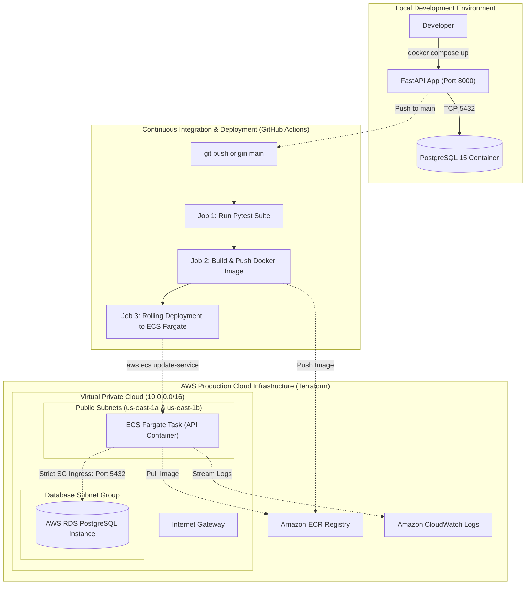

# Scalable Product Catalog REST API

A production-ready, cloud-native RESTful API built with **FastAPI**, **PostgreSQL**, and **SQLModel**, packaged with **multi-stage Docker**, provisioned on **AWS (ECS Fargate & RDS)** using **Terraform (IaC)**, and continuously integrated and deployed via **GitHub Actions**.

Developed by **KALARI SRISUCHA** ([@sucha6174](https://github.com/sucha6174)).

---

## Architecture Overview



---

## Core Features & Engineering Highlights

- **RESTful API Design**: Strict separation of concerns across routing (`src/main.py`), database models (`src/models.py`), Pydantic validation schemas (`src/schemas.py`), CRUD operations (`src/crud.py`), and session lifecycle (`src/database.py`).
- **Fail-Fast Reliability**: Application startup validates database connectivity during the lifespan event, immediately surfacing database initialization errors.
- **Hardened Multi-Stage Docker Build**: Utilizes a builder stage to compile wheels and a minimal runtime stage. The container executes under a dedicated non-root user (`appuser`, UID 8888) adhering to least-privilege security.
- **Local Orchestration**: `docker-compose.yml` orchestrates PostgreSQL and FastAPI with an inline health check and readiness polling script to ensure database availability before API launch.
- **Infrastructure as Code (Terraform)**:
  - Multi-AZ VPC across two Availability Zones (`us-east-1a`, `us-east-1b`).
  - Strict security groups: Inbound database access on port 5432 is restricted exclusively to the API security group.
  - Managed AWS RDS PostgreSQL with `skip_final_snapshot = true` for dev lifecycle management.
  - Serverless container execution using AWS ECS Fargate and Amazon ECR.
  - Centralized log streaming to CloudWatch Log Groups.
- **Continuous Integration & Continuous Deployment (CI/CD)**: GitHub Actions workflow triggers on pushes to `main`, runs automated unit and integration tests, builds and tags Docker images with both Git commit SHA and `latest`, pushes to ECR, and triggers zero-downtime rolling updates on ECS Fargate.

---

## Repository Structure

```text
.
├── .github/
│   └── workflows/
│       └── main.yml           # GitHub Actions CI/CD pipeline
├── src/
│   ├── __init__.py            # Package initialization
│   ├── crud.py                # Database interaction and CRUD business logic
│   ├── database.py            # SQLAlchemy/SQLModel engine and session management
│   ├── main.py                # FastAPI application entrypoint and route handlers
│   ├── models.py              # SQLModel database entity schemas
│   └── schemas.py             # Pydantic request and response validation schemas
├── tests/
│   ├── __init__.py
│   ├── unit/
│   │   ├── __init__.py
│   │   └── test_unit.py       # Isolated CRUD tests using in-memory SQLite
│   └── integration/
│       ├── __init__.py
│       └── test_integration.py# HTTP endpoint tests using FastAPI TestClient
├── terraform/
│   ├── versions.tf            # Terraform and AWS provider constraints
│   ├── variables.tf           # Infrastructure input variables
│   ├── vpc.tf                 # VPC, Subnets, Internet Gateway, and Route Tables
│   ├── security_groups.tf     # Least-privilege firewall definitions
│   ├── ecr.tf                 # Amazon ECR repository and lifecycle policy
│   ├── rds.tf                 # Managed RDS PostgreSQL and subnet group
│   ├── ecs.tf                 # ECS Fargate Cluster, Task Definition, and Service
│   └── outputs.tf             # Output values and endpoint access commands
├── .env.example               # Template for environment variables
├── .gitignore                 # Files and directories excluded from version control
├── Dockerfile                 # Multi-stage production container definition
├── docker-compose.yml         # Local development environment orchestration
├── pytest.ini                 # Pytest discovery and pythonpath configuration
├── requirements.txt           # Pinned production and testing dependencies
└── README.md                  # Comprehensive project documentation
```

---

## API Specification

Interactive OpenAPI documentation is automatically served at:
- Swagger UI: `http://localhost:8000/docs`
- ReDoc: `http://localhost:8000/redoc`

### Endpoints Reference

| Method | Endpoint | Description | Request Body | Status Code |
| :--- | :--- | :--- | :--- | :--- |
| `GET` | `/` | API Information and documentation status | None | `200 OK` |
| `GET` | `/health` | Health check probe for orchestrators | None | `200 OK` |
| `POST` | `/products` | Create a new product in the catalog | `ProductCreate` JSON | `201 Created` / `422 Unprocessable` |
| `GET` | `/products` | List all catalog products with pagination | Query: `skip`, `limit` | `200 OK` |
| `GET` | `/products/{id}` | Retrieve a single product by ID | None | `200 OK` / `404 Not Found` |
| `PUT` | `/products/{id}` | Update an existing product's fields | `ProductUpdate` JSON | `200 OK` / `404 Not Found` |
| `DELETE` | `/products/{id}` | Delete a product from the database | None | `204 No Content` / `404 Not Found` |

### Sample JSON Payloads

#### Create Product (`POST /products`)
```json
{
  "name": "Mechanical Keyboard",
  "description": "Ergonomic wireless mechanical keyboard with hot-swappable switches",
  "price": 129.99,
  "stock": 50
}
```

#### Response (`201 Created`)
```json
{
  "id": 1,
  "name": "Mechanical Keyboard",
  "description": "Ergonomic wireless mechanical keyboard with hot-swappable switches",
  "price": 129.99,
  "stock": 50
}
```

#### Update Product (`PUT /products/1`)
```json
{
  "price": 119.99,
  "stock": 45
}
```

---

## Local Development Setup

### Option 1: Running with Docker Compose (Recommended)

1. Clone the repository:
   ```bash
   git clone git@github.com:sucha6174/fastapi-product-catalog-devops.git
   cd fastapi-product-catalog-devops
   ```

2. Copy the environment configuration:
   ```bash
   cp .env.example .env
   ```

3. Build and run the multi-container stack:
   ```bash
   docker compose up --build
   ```

4. Verify application health:
   ```bash
   curl http://localhost:8000/health
   ```

### Option 2: Running Locally with Python Virtual Environment

1. Create and activate a Python virtual environment:
   ```bash
   python -m venv .venv
   # On Linux/macOS:
   source .venv/bin/activate
   # On Windows:
   .\.venv\Scripts\Activate.ps1
   ```

2. Install pinned dependencies:
   ```bash
   pip install --upgrade pip
   pip install -r requirements.txt
   ```

3. Run the development server:
   ```bash
   uvicorn src.main:app --reload --host 0.0.0.0 --port 8000
   ```

---

## Automated Testing Suite

The project includes unit tests for isolated CRUD operations (using an in-memory SQLite database) and integration tests for all REST endpoints using FastAPI's `TestClient`.

Execute the test suite with:
```bash
pytest -v
```

Output:
```text
tests/integration/test_integration.py::test_root_endpoint PASSED
tests/integration/test_integration.py::test_health_endpoint PASSED
tests/integration/test_integration.py::test_create_product_success PASSED
tests/integration/test_integration.py::test_create_product_validation_failure_negative_price PASSED
tests/integration/test_integration.py::test_create_product_validation_failure_negative_stock PASSED
tests/integration/test_integration.py::test_create_product_validation_missing_fields PASSED
tests/integration/test_integration.py::test_get_all_products PASSED
tests/integration/test_integration.py::test_get_product_by_id_success PASSED
tests/integration/test_integration.py::test_get_product_by_id_not_found PASSED
tests/integration/test_integration.py::test_update_product_success PASSED
tests/integration/test_integration.py::test_update_product_not_found PASSED
tests/integration/test_integration.py::test_delete_product_success PASSED
tests/integration/test_integration.py::test_delete_product_not_found PASSED
tests/unit/test_unit.py::test_create_product PASSED
tests/unit/test_unit.py::test_get_products_empty PASSED
tests/unit/test_unit.py::test_get_products_pagination PASSED
tests/unit/test_unit.py::test_get_product_by_id PASSED
tests/unit/test_unit.py::test_update_product PASSED
tests/unit/test_unit.py::test_delete_product PASSED
============================= 19 passed in 1.01s ==============================
```

---

## Infrastructure Deployment with Terraform

All cloud infrastructure is codified using declarative HashiCorp Terraform inside the `terraform/` directory.

### Prerequisites
- AWS CLI configured with administrator or deployment permissions.
- Terraform CLI (>= 1.5.0) installed.

### Step-by-Step Deployment

1. Navigate to the terraform directory:
   ```bash
   cd terraform
   ```

2. Initialize Terraform and download AWS provider plugins:
   ```bash
   terraform init
   ```

3. Review the execution plan:
   ```bash
   terraform plan
   ```

4. Apply the configuration to provision AWS resources:
   ```bash
   terraform apply -auto-approve
   ```

5. Retrieve deployment outputs:
   ```bash
   terraform output
   ```

6. To retrieve the public IP of the active ECS Fargate task:
   ```bash
   aws ec2 describe-network-interfaces \
     --network-interface-ids $(aws ecs describe-tasks \
       --cluster fastapi-product-catalog-prod-cluster \
       --tasks $(aws ecs list-tasks --cluster fastapi-product-catalog-prod-cluster --service-name fastapi-product-catalog-prod-service --query 'taskArns[0]' --output text) \
       --query 'tasks[0].attachments[0].details[?name==`networkInterfaceId`].value' --output text) \
     --query 'NetworkInterfaces[0].Association.PublicIp' --output text
   ```

7. **Cleanup**: Destroy provisioned infrastructure to avoid AWS costs:
   ```bash
   terraform destroy -auto-approve
   ```

---

## CI/CD Pipeline Automation (GitHub Actions)

The repository includes a complete Continuous Integration and Continuous Deployment pipeline configured in `.github/workflows/main.yml`.

### Pipeline Stages

1. **Test Stage**:
   - Spins up an Ubuntu runner with Python 3.12.
   - Installs dependencies from `requirements.txt`.
   - Executes `pytest -v tests/`. Halts pipeline if any test fails.

2. **Build & Push Stage**:
   - Triggers upon merge or push to `main`.
   - Authenticates securely with AWS using `aws-actions/configure-aws-credentials`.
   - Logs into Amazon Elastic Container Registry (ECR).
   - Builds the Docker image via multi-stage build.
   - Tags the image with both the Git commit SHA (`${{ github.sha }}`) and `latest`.
   - Pushes both tags to Amazon ECR.

3. **Deploy Stage**:
   - Invokes `aws ecs update-service --force-new-deployment`.
   - ECS Fargate performs a rolling update by pulling the updated image and cycling tasks with zero downtime.

### Required GitHub Secrets

To activate the pipeline in your repository, configure the following secrets under **Settings > Secrets and variables > Actions**:

| Secret Name | Description |
| :--- | :--- |
| `AWS_ACCESS_KEY_ID` | IAM User Access Key with ECR and ECS deployment permissions |
| `AWS_SECRET_ACCESS_KEY` | IAM User Secret Access Key |
| `AWS_REGION` | Target AWS Region (e.g., `us-east-1`) |

---

## Security Best Practices Implemented

- **Non-Root Container**: Container runs under a dedicated unprivileged user (`appuser`, UID 8888).
- **Network Isolation**: The RDS PostgreSQL instance is deployed without public IP addresses and restricts port 5432 ingress solely to the API ECS security group.
- **Credential Hygiene**: Sensitive variables like database passwords and AWS credentials are parameterized and never committed to source control.
- **Fail-Fast Initialization**: Database connectivity issues during application bootstrap immediately trigger fatal errors rather than silent failure.
- **Input Sanitization**: Pydantic models enforce strict data validation, rejecting negative prices, negative stock, and malformed inputs.
- **Container Hygiene**: Multi-stage build discards compilation tools and GCC libraries, drastically shrinking image size and reducing vulnerability surface.
